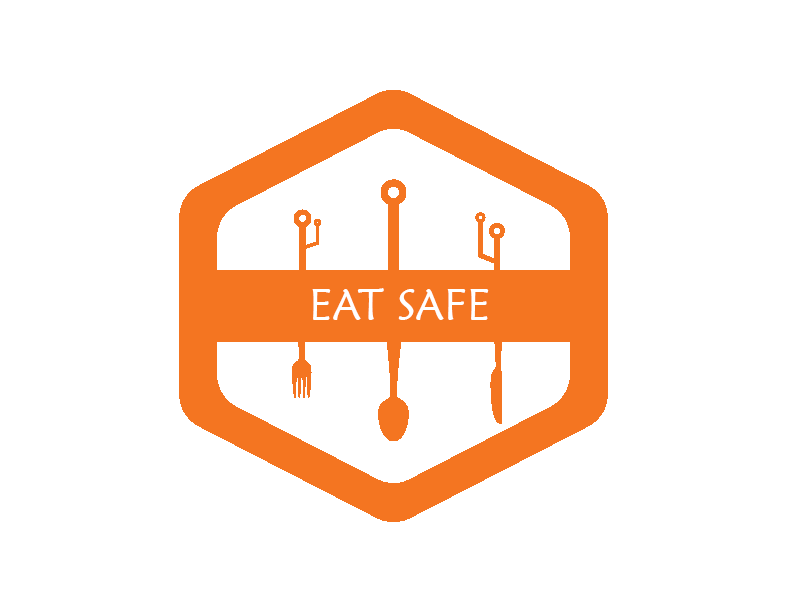

 
 

# EatSafe
EatSafe is a platform which combines food quality indexing using hardware with decentralization and process
tracking. 
___

 
 

## EatSafe uses the following

 

- [X] Blockchain for food supply chain
- [X] Arduino for food quality testing
- [X] Machine learning for food quality prediction based on results of the hardware

 
 

## EatSafe accomplishes the following

 

- [X] Food supply chain that’s un-hackable and un-corruptable 
- [X] Health standards that learn
- [X] Food and soil indexing that’s visualizable

 
 

## Future Scope of EatSafe

 

* Detect diseases in plants

* Distribution of left over food

* Geotagging batch productions

* Useful statistics for study of GM crops

* Seed storage share 

* Loan eligibility based on quality produced

